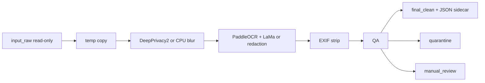

# PrivaGen

GPU-first image anonymizer that detects faces/bodies and on-image text, strips EXIF, and writes a JSON audit per file.

It is for teams that need to ship or archive a large photo set without leaving identity or GPS in the files.

It does not process video, it does not write to originals, and it does not run without an explicit **Images Only** confirmation in the UI.

## Why I built it

I needed a pipeline that could take tens of thousands of sensitive stills, prove what happened to each file, and keep working when the GPU node dies. CPU fallback is not a demo mode. It is the run continuing.

## What it does

1. Ingest to `input_raw/` (read-only). Optional rclone pull from a read-only object-store key.
2. Copy to temp. Never mutate the original.
3. Faces/bodies: DeepPrivacy2 GAN on GPU, OpenCV blur on CPU.
4. Text: PaddleOCR, then LaMa/IOPaint on GPU or OpenCV redaction on CPU.
5. Strip EXIF / GPS / device tags (ExifTool primary, Pillow fallback).
6. QA routes to `final_clean/`, `quarantine/`, or `manual_review/`.
7. Per-image JSON sidecar + master CSV/PDF + append-only audit JSON.



## Stack

Python 3.10, Flask dashboard, DeepPrivacy2, PaddleOCR, IOPaint/LaMa, InsightFace QA, ExifTool/Pillow, optional rclone + Backblaze two-key model, optional CrewAI QA if `OPENAI_API_KEY` is set. GPU first, CPU fallback automatic.

## Guardrails

| Guardrail | What it means |
|-----------|---------------|
| Originals never written | `input_raw/` is guarded; every image is copied to `temp_processed/` before any pixel changes |
| Images only | `processing_mode: images_only` is locked in `config.yaml`; the UI makes the operator confirm it, and each run is stamped in `reports/run_scope.json` |
| Checksums | SHA-256 of source bytes and output bytes recorded in each JSON sidecar |
| Two-key object store | Read-only key for ingest, separate read/write key for export, separate buckets |
| `redact_logs` | Secret values are never logged — key names only |
| Empty data dirs in git | `input_raw/`, `final_clean/`, `quarantine/`, `manual_review/`, `temp_processed/`, `reports/`, `logs/` ship with only a `.gitkeep` |
| Human review folder | QA failures go to `manual_review/` instead of silently passing |

## Quick start

```bash
git clone https://github.com/DannyBarren/PrivaGen-Anonymizer.git
cd PrivaGen-Anonymizer
```

```bash
conda create -n privagen python=3.10 -y && conda activate privagen
# or: python3.10 -m venv .venv && source .venv/bin/activate

pip install -r requirements-ui.txt
python app.py
```

Open <http://127.0.0.1:5000>. In the Setup panel, click **Install All Dependencies** and wait for **Ready for GPU** or **Ready for CPU fallback**. Drop images into `input_raw/` locally — do not commit them. Enable **Test mode**, set max images to `5`, press **Start**.

CLI equivalents:

```bash
python -m scripts.main_pipeline --test-mode --max-images 5
python -m scripts.main_pipeline --dry-run
python -m scripts.environment_checker
python -m scripts.health_check
```

Docs: [docs/QUICKSTART.md](docs/QUICKSTART.md) · [docs/ARCHITECTURE.md](docs/ARCHITECTURE.md) · [docs/DEPLOY.md](docs/DEPLOY.md) · [docs/TROUBLESHOOTING.md](docs/TROUBLESHOOTING.md)

## What this is evidence of

- A CV pipeline with a real operator UI, not a notebook.
- A GPU path plus automatic CPU fallback that still emits full JSON audits.
- Read-only originals, checksums, and three-way routing: clean, quarantine, manual review.
- Built to run at tens of thousands of stills (~37k-image batches) without putting the dataset in git.

## Notes

This repo ships with empty data directories. There is no sample dataset here and no images in git history. Bucket names and remote paths in `config.yaml` and `.env.example` are placeholders — set your own.

PrivaGen is a Barren Business Development product. MIT licensed; see [LICENSE](LICENSE). You are responsible for lawful use, consent, and any biometric/PII regulation that applies to your data.
